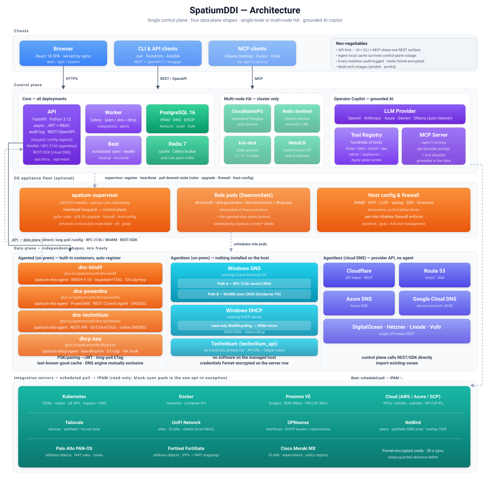

# System Architecture

> System topology, component relationships, and the HA design.
> Start here to understand how the control plane, the managed
> service containers, and the agents fit together before reading
> the per-feature or per-deployment specs.
>
> **Related:** [`deployment/TOPOLOGIES.md`](deployment/TOPOLOGIES.md)
> (six reference production layouts),
> [`deployment/DNS_AGENT.md`](deployment/DNS_AGENT.md) (the agent
> container contract in full), [`deployment/DOCKER.md`](deployment/DOCKER.md),
> [`deployment/APPLIANCE.md`](deployment/APPLIANCE.md), and
> [`OBSERVABILITY.md`](OBSERVABILITY.md). The repo-wide conventions
> and non-negotiables live in [`../CLAUDE.md`](https://github.com/spatiumnorth/spatiumddi/blob/main/CLAUDE.md).

---

## 1. The Big Picture

SpatiumDDI is an all-in-one DDI platform built around **one control
plane** that is the single source of truth, plus a set of **data-plane
service containers** (DNS and DHCP daemons) that the control plane
deploys, configures, and runs.

  

Three properties define the design and are enforced everywhere
(see [`../CLAUDE.md`](https://github.com/spatiumnorth/spatiumddi/blob/main/CLAUDE.md) "Absolute Non-Negotiables"):

- **API-first** — every UI action is a REST call. The browser SPA, CLI
  tooling, and the MCP surface for the Operator Copilot all share the
  same `/api/v1` surface; the API validates authorization
  independently of the UI.
- **Source-of-truth control plane** — PostgreSQL holds the desired
  state; the service containers are projections of it. SpatiumDDI does
  not merely point at external DDI servers — it renders their config
  and runs them.
- **Agents survive control-plane outage** — every DNS/DHCP agent caches
  its last-known-good config on local disk and keeps serving if the
  control plane is unreachable.

---

## 2. Control Plane

The control plane is five long-lived processes plus two datastores. In
Docker Compose they are the `frontend`, `api`, `worker`, `beat`,
`migrate`, `postgres`, and `redis` services
(`docker-compose.yml`); in Kubernetes they map to the corresponding
manifests under [`../k8s/base/`](https://github.com/spatiumnorth/spatiumddi/tree/main/k8s/base) and the umbrella chart
[`../charts/spatiumddi/`](https://github.com/spatiumnorth/spatiumddi/tree/main/charts/spatiumddi).

### api — FastAPI + uvicorn

The HTTP brain. Async throughout (no synchronous DB or network calls in
request handlers). It owns:

- The REST API at `/api/v1/*` (route handlers under
  `backend/app/api/v1/`), with OpenAPI docs at `/api/docs` and
  `/api/redoc`.
- JWT auth + group-scoped RBAC (`{action, resource_type,
  resource_id?}` — see [`PERMISSIONS.md`](PERMISSIONS.md)).
- The agent-facing long-poll endpoints (`GET /dns/agents/config`,
  `GET /dhcp/agents/config`) and registration/heartbeat endpoints.
- The MCP JSON-RPC endpoint for the Operator Copilot at
  `/api/v1/ai/mcp` (`backend/app/api/v1/ai/mcp.py`), exposing hundreds
  of `find_*` / `count_*` read tools plus apply-gated `propose_*`
  writes.

Every mutation writes an append-only `AuditLog` row
(`backend/app/models/audit.py`) into the same transaction as the change
before the response is returned — routers build the row and add it to
the session next to the mutated entity (e.g. `_audit(...)` in
`backend/app/api/v1/ipam/router.py`), so an audit gap and a rolled-back
write are the same event.

### worker — Celery

Background execution for everything that must not block a request:
IPAM↔DNS sync, DNS/DHCP health checks, lease sweeps, integration
reconcilers, alert evaluation, blocklist feed refresh, the Operator
Copilot digest, and more (`backend/app/tasks/`). All tasks are written
to be idempotent and safe to retry.

### beat — Celery schedule

The scheduler that *enqueues* periodic tasks (the schedule lives in
`backend/app/celery_app.py`). Beat runs as a **singleton** — exactly
one replica, `Recreate` rollout strategy — because two beats would
double-enqueue. The deliberate decision not to add leader election is
documented inline in
[`../charts/spatiumddi/templates/beat.yaml`](https://github.com/spatiumnorth/spatiumddi/blob/main/charts/spatiumddi/templates/beat.yaml):
beat only enqueues, every task is itself idempotent, and the broker
(Redis) is already HA, so a Redis-backed beat lock would add a
node-drain-blocking workload for no correctness gain.

### frontend — nginx + React SPA

React 18 + TypeScript (Vite, shadcn-style primitives, Tailwind, React
Query) built to static assets and served by nginx, which also reverse-
proxies the API. The host-published port defaults to `8077`
(`HTTP_PORT`); see [`deployment/DOCKER.md`](deployment/DOCKER.md) for
the full port reference and TLS setup.

### migrate — one-shot Alembic job

`alembic upgrade head` runs as a short-lived job/container before the
api becomes ready ([`../k8s/base/migrate-job.yaml`](https://github.com/spatiumnorth/spatiumddi/blob/main/k8s/base/migrate-job.yaml)).
On a fresh multi-node install the api deliberately stays **out of the
Service endpoint set until the schema matches the head its image
expects**: `/health/ready` reads the bundled Alembic head once and
compares it against `SELECT version_num FROM alembic_version`
(`backend/app/api/health.py`), returning distinct detail strings for
"schema not initialised", "alembic_version row missing", and "schema
behind / image expects Y" so cold-boot vs connectivity failures are
never ambiguous.

### PostgreSQL 16 — the source of truth

Holds IPAM (spaces / blocks / subnets / addresses), DNS (zones /
records / views / groups), DHCP (servers / scopes / pools / leases),
network modeling, auth/RBAC, the audit log, and platform settings. The
service containers never hold authoritative state of their own; they
render from what the control plane assembles.

### Redis 7 — broker, cache, and wake bus

Three jobs: the Celery broker/result backend, a general cache /
sessions store, and the **agent-wake pub/sub bus** (see §4). Treat both
Postgres and Redis as internal-only — never expose them to the host or
network.

> The non-negotiable stack pins **Redis 7**; the shipped Compose file
> currently runs a newer `redis:*-alpine` tag. Either way the app
> connects via `settings.redis_url` (and `sentinel://` URLs in HA).

---

## 3. Data Plane — Managed Service Containers

The data plane is the DNS and DHCP daemons SpatiumDDI deploys and runs.
Each daemon ships with a thin **agent** sidecar that registers with the
control plane, pulls config, and applies it. Available service images
(see `docker-compose.yml` profiles and `ghcr.io/spatiumnorth/*`):

| Image | Daemon | Driver |
|---|---|---|
| `dns-bind9` | BIND9 | `bind9` |
| `dns-powerdns` | PowerDNS (+ optional `dns-dnsdist`) | `powerdns` |
| `dns-technitium` | Technitium DNS Server | `technitium` |
| `dhcp-kea` | Kea DHCPv4/DHCPv6 | `kea` |

The DNS agent lives in [`../agent/dns/spatium_dns_agent/`](https://github.com/spatiumnorth/spatiumddi/tree/main/agent/dns/spatium_dns_agent),
the DHCP agent in [`../agent/dhcp/spatium_dhcp_agent/`](https://github.com/spatiumnorth/spatiumddi/tree/main/agent/dhcp/spatium_dhcp_agent).
Both are multi-arch (`linux/amd64` + `linux/arm64`).

### Driver abstraction

Backend-specific logic never leaks into the service layer.
`backend/app/drivers/{dns,dhcp}/base.py` defines an ABC plus neutral
dataclasses (`ConfigBundle`, `ZoneData`, `ServerOptions`, scope/pool
shapes, etc.). Concrete drivers (`bind9.py`, `powerdns.py`,
`technitium.py`, `kea.py`)
render backend-specific config from those dataclasses; the services
layer only ever speaks to the ABC. There are also **agentless**
drivers — Windows DNS/DHCP over WinRM, cloud DNS (Cloudflare / Route 53
/ Azure DNS / Google Cloud DNS) over the provider SDK — which the api
drives directly with no agent on the far side. See
[`drivers/DNS_DRIVERS.md`](drivers/DNS_DRIVERS.md) and
[`drivers/DHCP_DRIVERS.md`](drivers/DHCP_DRIVERS.md).

### The supervisor (OS appliance only)

On the OS appliance, a per-host **`spatium-supervisor`**
([`../agent/supervisor/spatium_supervisor/`](https://github.com/spatiumnorth/spatiumddi/tree/main/agent/supervisor/spatium_supervisor))
owns all appliance-host concerns the service containers used to carry:
slot telemetry + slot-upgrade/reboot triggers, SNMP / chrony / firewall
/ timezone reload triggers, deployment-kind detection, and role
assignment. The DNS/DHCP service containers keep only their own
service-level concerns (register, config long-poll, lease events,
metrics). See the "Post-#170 architecture" section of
[`deployment/DNS_AGENT.md`](deployment/DNS_AGENT.md) for the split.

---

## 4. Config Delivery — ConfigBundle + ETag Long-Poll + Redis Wake

This is the core control-plane → data-plane mechanism. Three layers
stack on top of each other.

### ConfigBundle + ETag

The control plane assembles a neutral `ConfigBundle` from DB state and
hashes its contents to a stable SHA-256 ETag
(`backend/app/services/dns/config_bundle.py`,
`backend/app/services/dhcp/config_bundle.py`;
`ConfigBundle.compute_etag()` in `backend/app/drivers/{dns,dhcp}/base.py`).
The hash deliberately excludes the etag field and the `generated_at`
timestamp, so two runs over identical state produce the same ETag.

> **When you add a field that affects rendered config, make sure it
> flows into the bundle so the ETag shifts** — otherwise agents will
> never see the change. (The DHCP path additionally wraps its
> driver-dataclass etag with a fleet-upgrade marker so a Fleet command
> wakes the poll even when the rendered bundle is byte-identical —
> `backend/app/api/v1/dhcp/agents.py`.)

### ETag long-poll

The agent holds an HTTP long-poll open on `/config`, passing its
last-seen ETag as `If-None-Match`. The api handler rebuilds the bundle,
compares the new ETag against the agent's, and:

- **returns the new bundle immediately** if the ETag changed (or there
  are pending per-record ops), persisting the new `last_config_etag`;
- **returns `304 Not Modified`** when the deadline elapses with no
  change.

See the loop in `backend/app/api/v1/dns/agents.py`
(`agent_config_longpoll`). The ETag compare is the **sole source of
truth** for whether the agent reloads.

> **Wire form of the ETag (#862).** The internal value is a bare
> `sha256:<hex>` — that is what the DB columns, the bundle body's own
> `etag` field, `structural_etag` and the agents' on-disk cache all
> hold. On the wire it is emitted as a **weak, quoted** entity-tag,
> `W/"sha256:<hex>"`, via `format_etag` in
> `backend/app/core/http_etag.py`. Two reasons, and both are load-bearing:
> an unquoted tag is malformed per RFC 9110 §8.8.3, and a *strong* tag is
> deleted outright by nginx's gzip filter — which cannot honestly assert
> byte-identity for a body it just compressed. Both the appliance and
> compose nginx gzip `application/json`, so before this the header simply
> vanished for any client sending `Accept-Encoding: gzip`. A weak tag is
> also the semantically correct one: gzipped and identity are different
> representations of the same payload, which is exactly what `W/` means.
>
> Incoming `If-None-Match` is compared with `etag_matches`, which accepts
> the weak, strong-quoted and legacy-bare spellings plus `*` and
> comma-separated lists. That tolerance is what stops the whole fleet
> re-downloading a bundle on the first poll after an upgrade. **Compare
> with `etag_matches`, never with `==`** — a raw compare re-breaks the
> conditional poll for every client that normalises the header.

### Redis wake (#358)

The long-poll no longer blind-polls the DB on a fixed tick. It waits on
a Redis pub/sub channel for that agent's group/server
(`backend/app/core/agent_wake.py`); config-mutating handlers publish to
that channel **after commit**, collapsing change latency to well under
a second. The DNS-record path publishes through the `enqueue_record_op`
chokepoint via the request-scoped `collect_wake` collector that the
`wake_publishing` router dependency flushes after the handler's commit;
DHCP/structural handlers call `collect_wake` directly; Celery workers
call `publish_wake` over `settings.redis_url`.

The wake is **purely advisory** and never the sole delivery path
(non-negotiable #5):

- `publish_wake` is fire-and-forget — any Redis error is swallowed and
  logged, never propagated into the mutating request.
- The subscription degrades to a plain sleep on any Redis error, so a
  Redis-down deployment behaves byte-for-byte like the old fixed-tick
  poll (`LONGPOLL_POLL_INTERVAL_FALLBACK = 2 s`).
- A genuinely missed publisher is still caught by the belt-and-braces
  `WAKE_TICK_SECONDS` (12 s) safety tick — worst case is ≤12 s
  convergence, never staleness.

The same bus also wakes the supervisor heartbeat long-poll on a
per-appliance channel (`appliance_channel(id)`) when a desired-state
column (fleet upgrade / reboot / role assignment / host config)
changes, so commands start in ~0 s instead of waiting a heartbeat
interval (`backend/app/api/v1/appliance/supervisor.py`). The fleet-scale
broker escalation beyond Redis is deferred — see
[`OBSERVABILITY.md`](OBSERVABILITY.md).

---

## 5. Agent Bootstrap, Reconnection, and Local Cache

### Bootstrap

A standalone agent joins with a pre-shared key (`DNS_AGENT_KEY` /
`SPATIUM_AGENT_KEY`), exchanges it for a rotating JWT, and caches the
JWT on disk (`bootstrap.py` / `cache.py` in each agent). The agent ID
and token live under the agent state dir alongside the config cache.

### Reconnection

On **401 or 404** the agent drops its cached token and re-bootstraps
from the PSK. 401 covers an expired/invalid token; 404 covers a stale
server row after a control-plane reset. Both the sync loop and the
heartbeat loop implement this same recovery path
(`agent/dns/spatium_dns_agent/sync.py`,
`agent/dns/spatium_dns_agent/heartbeat.py`; the DHCP agent mirrors it).

> On the OS appliance the PSK is delivered automatically: the supervisor
> writes the per-role agent key into `role-compose.env`, which the
> service container interpolates on first boot — the operator never
> pastes a key. Standalone Docker/K8s agents paste the PSK directly
> (the `/pair` exchange was removed from the agents in #246).

### Local config cache (non-negotiable #5)

Each agent persists its last-known-good bundle on disk
(`/var/lib/spatium-dns-agent/`, `/var/lib/spatium-dhcp-agent/`;
`config/current.json` + `current.etag` + a `previous.json` rollback
copy — see the `cache.py` header). On startup the agent loads the
cached bundle and renders + applies it **before** contacting the
control plane, so a pod that restarts while the control plane is down
comes up warm and keeps serving. After every successful sync the cache
is atomically re-written. In Kubernetes/appliance multi-node, this
cache lives on per-node `hostPath` so a node keeps serving DNS/DHCP
through a control-plane outage (#292).

### Incremental DNS updates (non-negotiable #8)

DNS record changes are applied incrementally — RFC 2136 `nsupdate` over
TSIG (BIND9) or the driver API (PowerDNS / Technitium / cloud) — never a
full server restart. Per-record ops are queued as `DNSRecordOp` rows fanned out to
every agent-based server in the group and shipped on the config
long-poll. See [`drivers/DNS_DRIVERS.md`](drivers/DNS_DRIVERS.md).

---

## 6. High Availability

HA scales independently at three tiers (see
[`deployment/TOPOLOGIES.md`](deployment/TOPOLOGIES.md) for the full
sizing matrix and the "you have X → start with topology Y" picker).

### Data plane

DNS and DHCP are made HA by running **multiple agents per group**.
Every DNS agent renders its group's zones as an independent
authoritative copy, so adding a second BIND9 / PowerDNS / Technitium
agent to a group gives you a redundant authoritative server with no
extra coordination.
For DHCP, two or more Kea members in a server group form a Kea HA pair
(scopes/pools/statics live on the group;
`agent/dhcp/spatium_dhcp_agent/peer_resolve.py` self-heals peer IP
drift). The on-disk config cache (§5) means each data-plane node keeps
serving even when the control plane is unreachable.

### Control plane (Docker Compose / generic K8s)

The api, worker, and frontend are stateless and scale horizontally;
beat stays a singleton (§2). For the datastores you bring HA Postgres
(Patroni or CloudNativePG) and HA Redis (Sentinel). The umbrella chart
([`../charts/spatiumddi/`](https://github.com/spatiumnorth/spatiumddi/tree/main/charts/spatiumddi)) ships an in-chart
Redis Sentinel option; reference HA add-ons live under
[`../k8s/ha/`](https://github.com/spatiumnorth/spatiumddi/tree/main/k8s/ha) (`postgres-cluster.yaml` for CloudNativePG,
`redis-sentinel.yaml`, and a Patroni Compose). When Redis is HA the app
connects via a `sentinel://` URL and the wake bus follows failover
through the Sentinel-aware Redis client.

### OS appliance — single ISO, 1 → N nodes (#272)

The appliance runs the whole control plane on **embedded-etcd k3s** and
takes you from one node to a 3 / 5 / 7-node HA cluster, driven from the
Fleet tab in `/appliance`:

- **k3s embedded etcd** provides cluster state quorum. Promote/demote of
  control-plane members is operator-driven (multi-select with an
  odd-member-count guard); the supervisor labels nodes and scales the
  workloads. Dead-node eviction issues a replacement pairing code.
- **PostgreSQL HA via CloudNativePG** — a primary plus streaming
  replicas with automatic failover; the permanent appliance default.
  On promote, the supervisor scales the CNPG `Cluster` directly via a
  merge-patch (`agent/supervisor/spatium_supervisor/k8s_api.py`),
  because the `helm.sh/resource-policy: keep` annotation that protects
  the DB makes the Helm controller skip `spec.instances` patches.
- **Redis HA via Sentinel** — a 3-node Sentinel set with master
  election; the app runs on `sentinel://`.
- **MetalLB L2 control-plane VIP** — one stable UI/API address that
  floats across replicas, shipped in its own `metallb-system` namespace
  ([`../charts/spatiumddi-metallb/`](https://github.com/spatiumnorth/spatiumddi/tree/main/charts/spatiumddi-metallb)).
  The operator sets the pool + VIP from Fleet → Network & Host.

Beat/migrate/audit-chain are singleton-tolerant, and one shared Web UI
TLS cert is served across replicas. Per-role node-label gating
(`spatium.io/role-<service>=true`) keeps DNS-only nodes from silently
scheduling control-plane workloads. The atomic A/B slot upgrade and the
multi-node rolling upgrade orchestrator are described in
[`deployment/APPLIANCE.md`](deployment/APPLIANCE.md).

> ⚠️ The HA partition layout (6-partition GPT + Talos `state`
> partition) is not A/B-upgradeable across the pre-HA layout — older
> field-test appliances must full-reinstall from the HA ISO. See the
> appliance release notes in [`../CHANGELOG.md`](https://github.com/spatiumnorth/spatiumddi/blob/main/CHANGELOG.md).

---

## 7. Where to Go Next

- Reference layouts and sizing → [`deployment/TOPOLOGIES.md`](deployment/TOPOLOGIES.md)
- The agent container contract end to end → [`deployment/DNS_AGENT.md`](deployment/DNS_AGENT.md)
- Docker Compose setup, ports, TLS → [`deployment/DOCKER.md`](deployment/DOCKER.md)
- The OS appliance, slots, and fleet → [`deployment/APPLIANCE.md`](deployment/APPLIANCE.md)
- Logging, metrics, health, alerting → [`OBSERVABILITY.md`](OBSERVABILITY.md)
- RBAC grammar and builtin roles → [`PERMISSIONS.md`](PERMISSIONS.md)
- Driver internals → [`drivers/DNS_DRIVERS.md`](drivers/DNS_DRIVERS.md), [`drivers/DHCP_DRIVERS.md`](drivers/DHCP_DRIVERS.md)
- The database model map → [`DATA_MODEL.md`](DATA_MODEL.md); REST API conventions → [`API.md`](API.md)
- Coding standards, tests, and the CI pipeline → [`DEVELOPMENT.md`](DEVELOPMENT.md); repo-wide conventions and non-negotiables → [`../CLAUDE.md`](https://github.com/spatiumnorth/spatiumddi/blob/main/CLAUDE.md)
